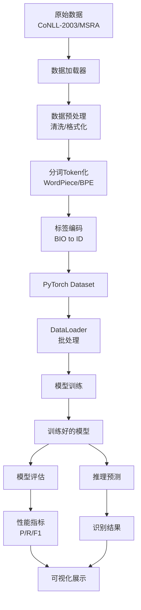
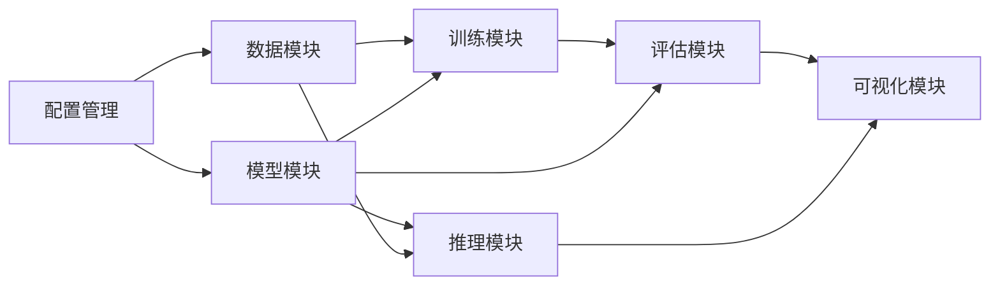

# 中英双语命名实体识别系统 - 概要设计文档

## 1. 系统概述

### 1.1 设计目标

本系统采用模块化设计思想，构建一个灵活、可扩展的命名实体识别平台。系统支持多种深度学习模型，提供完整的训练、评估、推理pipeline，并通过配置文件实现实验管理。

### 1.2 设计原则

1. **模块化**：各功能模块职责单一，接口清晰
2. **可扩展**：易于添加新模型、新数据集、新功能
3. **配置驱动**：通过配置文件管理实验参数
4. **面向接口**：定义抽象基类，实现多态
5. **测试友好**：模块间低耦合，便于单元测试

## 2. 系统架构设计

### 2.1 总体架构

系统采用经典的三层架构设计：

```
┌─────────────────────────────────────────────────────────┐
│                     应用层 (Application Layer)            │
│  ┌──────────┐  ┌──────────┐  ┌──────────┐  ┌──────────┐│
│  │  训练器   │  │  评估器   │  │  推理器   │  │ 可视化   ││
│  └──────────┘  └──────────┘  └──────────┘  └──────────┘│
└─────────────────────────────────────────────────────────┘
                            ↕
┌─────────────────────────────────────────────────────────┐
│                     模型层 (Model Layer)                 │
│  ┌──────────┐  ┌──────────┐  ┌──────────┐              │
│  │   BERT   │  │ RoBERTa  │  │BiLSTM-CRF│              │
│  └──────────┘  └──────────┘  └──────────┘              │
│                   统一模型接口 (BaseModel)                │
└─────────────────────────────────────────────────────────┘
                            ↕
┌─────────────────────────────────────────────────────────┐
│                     数据层 (Data Layer)                  │
│  ┌──────────┐  ┌──────────┐  ┌──────────┐              │
│  │数据加载器 │  │  分词器   │  │标签编码器│              │
│  └──────────┘  └──────────┘  └──────────┘              │
└─────────────────────────────────────────────────────────┘
```

### 2.2 数据流设计



### 2.3 模块依赖关系



## 3. 技术栈选型

### 3.1 核心技术栈

| 技术领域 | 选型 | 版本 | 说明 |
|---------|------|------|------|
| 编程语言 | Python | 3.8+ | 主流NLP开发语言 |
| 深度学习框架 | PyTorch | 1.10+ | 灵活的动态图框架 |
| 预训练模型库 | Transformers | 4.20+ | Hugging Face模型库 |
| 数组计算 | NumPy | 1.20+ | 数值计算基础库 |
| 数据处理 | Pandas | 1.3+ | 数据分析处理 |
| NER评估 | seqeval | 1.2+ | 序列标注评估 |
| 机器学习 | scikit-learn | 1.0+ | 通用机器学习库 |
| 可视化 | Matplotlib | 3.4+ | 绘图库 |
| 可视化 | Seaborn | 0.11+ | 统计可视化 |
| 实体展示 | spaCy | 3.0+ | displaCy可视化 |
| 配置管理 | PyYAML | 5.4+ | YAML配置文件 |
| 日志管理 | logging | 内置 | Python标准日志 |
| 进度条 | tqdm | 4.60+ | 进度显示 |

### 3.2 预训练模型选择

#### 中文模型

| 模型名称 | HuggingFace ID | 参数量 | 特点 |
|---------|----------------|--------|------|
| BERT-base-chinese | bert-base-chinese | 110M | Google官方中文BERT |
| RoBERTa-wwm-ext | hfl/chinese-roberta-wwm-ext | 110M | 全词遮罩+扩展训练 |

#### 英文模型

| 模型名称 | HuggingFace ID | 参数量 | 特点 |
|---------|----------------|--------|------|
| BERT-base-cased | bert-base-cased | 110M | 保留大小写信息 |
| RoBERTa-base | roberta-base | 125M | 优化的BERT训练策略 |

### 3.3 标注方案

采用**BIO标注方案**：

- **B-X**（Begin）：实体X的开始
- **I-X**（Inside）：实体X的内部
- **O**（Outside）：非实体

**示例**：
```
输入: 张三在北京大学工作
标签: B-PER I-PER O B-ORG I-ORG I-ORG O
```

**优势**：
- 简单直观，易于理解
- 可以明确标识实体边界
- 避免实体重叠问题

## 4. 关键技术点

### 4.1 模型架构设计

#### 4.1.1 BERT/RoBERTa-NER架构

```
Input Text
    ↓
Tokenization (WordPiece/BPE)
    ↓
BERT/RoBERTa Encoder
    ↓
[CLS] [token1] [token2] ... [SEP]
    ↓
Hidden States (768-dim)
    ↓
Linear Layer (768 → num_labels)
    ↓
CRF Layer (可选)
    ↓
BIO Tags
```

**关键点**：
1. **子词对齐**：WordPiece分词后，需要将标签对齐到子词
   - 方法1：只保留第一个子词的标签
   - 方法2：所有子词使用相同标签
   - 本系统采用方法1

2. **CRF层**：约束标签转移合法性
   - 例如：I-PER不能直接跟在B-LOC后面
   - 提升标签序列的一致性

3. **特殊Token处理**：[CLS]、[SEP]、[PAD]的标签设为-100（忽略）

#### 4.1.2 BiLSTM-CRF架构

```
Input Text
    ↓
Character/Word Embedding
    ↓
Bidirectional LSTM
    ↓
Hidden States
    ↓
Linear Layer
    ↓
CRF Layer
    ↓
BIO Tags
```

**关键点**：
1. **词向量**：可使用预训练词向量（Word2Vec、GloVe）
2. **BiLSTM**：捕获双向上下文信息
3. **CRF**：学习标签转移约束

### 4.2 训练策略

#### 4.2.1 优化器配置

**AdamW优化器**：
- BERT/RoBERTa参数：学习率 2e-5 ~ 5e-5
- 分类层参数：学习率 1e-4 ~ 1e-3
- 权重衰减：0.01

**学习率调度**：
- Warm-up：前10%步数线性增加
- 之后：线性或余弦衰减

#### 4.2.2 正则化技术

1. **Dropout**：
   - BERT内部：0.1
   - 分类层：0.1-0.3

2. **梯度裁剪**：max_grad_norm = 1.0

3. **标签平滑**（可选）：label_smoothing = 0.1

#### 4.2.3 早停机制

- 监控指标：验证集F1-score
- 耐心值（patience）：3-5个epoch
- 保存最优模型检查点

### 4.3 数据处理技术

#### 4.3.1 长文本处理

**问题**：模型最大输入长度限制（BERT: 512 tokens）

**解决方案**：
1. **截断**：保留前N个词
2. **滑动窗口**：重叠切分长文本
3. **层次模型**：先分句，再识别

本系统采用方案1和2的结合：
- 训练时：截断到最大长度
- 推理时：使用滑动窗口

#### 4.3.2 数据不平衡处理

**问题**：O标签远多于实体标签

**解决方案**：
1. **加权损失**：给实体标签更高权重
2. **Focal Loss**：关注难分类样本
3. **重采样**：过采样实体样本

本系统采用方案1：为不同标签设置权重

#### 4.3.3 标签对齐

**问题**：子词分割导致标签不匹配

**示例**：
```
原始：  北京  大学
标签：B-LOC I-LOC
分词：  北  ##京  大  ##学
```

**解决方案**：
```python
# 方法1：第一个子词保留标签，其余设为-100
标签：B-LOC  -100  I-LOC  -100

# 方法2：所有子词使用相同标签
标签：B-LOC I-LOC I-LOC I-LOC
```

### 4.4 评估指标计算

#### 4.4.1 实体级别评估

使用`seqeval`库计算：

```python
from seqeval.metrics import (
    precision_score,
    recall_score,
    f1_score,
    classification_report
)
```

**严格匹配**：实体类型和边界都必须完全正确

**宽松匹配**（可选）：只要边界正确即可

#### 4.4.2 评估指标

1. **精确率（Precision）**：
   ```
   P = TP / (TP + FP)
   ```

2. **召回率（Recall）**：
   ```
   R = TP / (TP + FN)
   ```

3. **F1-score**：
   ```
   F1 = 2 * P * R / (P + R)
   ```

4. **每类实体的独立评估**

5. **混淆矩阵**

### 4.5 推理优化

#### 4.5.1 批处理

```python
# 批量推理
texts = ["文本1", "文本2", ...]
predictions = model.predict_batch(texts, batch_size=32)
```

#### 4.5.2 模型加速（可选）

1. **模型量化**：FP32 → FP16/INT8
2. **ONNX导出**：PyTorch → ONNX Runtime
3. **TorchScript**：JIT编译

### 4.6 可视化技术

#### 4.6.1 训练过程可视化

使用Matplotlib绘制：
- 损失曲线（Loss Curve）
- F1-score曲线
- 学习率变化曲线

#### 4.6.2 结果可视化

1. **实体高亮**：使用spaCy的displaCy

```python
from spacy import displacy

doc = {
    "text": "张三在北京大学工作",
    "ents": [
        {"start": 0, "end": 2, "label": "PER"},
        {"start": 3, "end": 7, "label": "ORG"}
    ]
}
displacy.render(doc, style="ent", manual=True)
```

2. **性能对比图**：柱状图、雷达图

3. **混淆矩阵**：热力图

## 5. 系统接口设计

### 5.1 数据接口

```python
class NERDataset:
    """NER数据集接口"""
    def __init__(self, data_path, tokenizer, max_length):
        pass
    
    def __len__(self):
        pass
    
    def __getitem__(self, idx):
        pass
```

### 5.2 模型接口

```python
class BaseNERModel(nn.Module):
    """NER模型基类"""
    def __init__(self, config):
        pass
    
    def forward(self, input_ids, attention_mask, labels=None):
        """前向传播"""
        pass
    
    def predict(self, input_ids, attention_mask):
        """推理预测"""
        pass
```

### 5.3 训练接口

```python
class Trainer:
    """训练器"""
    def __init__(self, model, train_loader, val_loader, config):
        pass
    
    def train_epoch(self):
        """训练一个epoch"""
        pass
    
    def evaluate(self):
        """评估模型"""
        pass
    
    def train(self):
        """完整训练流程"""
        pass
```

### 5.4 推理接口

```python
class NERPredictor:
    """推理器"""
    def __init__(self, model_path, config):
        pass
    
    def predict(self, text):
        """单句推理"""
        pass
    
    def predict_batch(self, texts):
        """批量推理"""
        pass
```

## 6. 配置管理

### 6.1 配置文件结构

使用YAML格式管理配置：

```yaml
# config/bert_chinese.yaml
model:
  name: "bert"
  pretrained_model: "bert-base-chinese"
  num_labels: 9  # O + B/I * 4类实体
  dropout: 0.1
  use_crf: true

training:
  batch_size: 16
  learning_rate: 3e-5
  num_epochs: 10
  warmup_ratio: 0.1
  weight_decay: 0.01
  max_grad_norm: 1.0
  
data:
  train_file: "data/chinese/train.txt"
  dev_file: "data/chinese/dev.txt"
  test_file: "data/chinese/test.txt"
  max_length: 128
  
output:
  save_dir: "experiments/bert_chinese"
  log_dir: "logs/bert_chinese"
```

### 6.2 配置加载

```python
import yaml

def load_config(config_path):
    with open(config_path, 'r', encoding='utf-8') as f:
        config = yaml.safe_load(f)
    return config
```

## 7. 目录结构设计

```
nlp_coursework/
├── configs/                      # 配置文件目录
│   ├── bert_chinese.yaml
│   ├── bert_english.yaml
│   ├── roberta_chinese.yaml
│   ├── roberta_english.yaml
│   └── bilstm_crf.yaml
│
├── data/                         # 数据目录
│   ├── raw/                      # 原始数据
│   │   ├── english/              # CoNLL-2003
│   │   └── chinese/              # MSRA
│   └── processed/                # 预处理后的数据
│
├── src/                          # 源代码目录
│   ├── __init__.py
│   ├── data_preprocessing/       # 数据预处理模块
│   │   ├── __init__.py
│   │   ├── dataset_loader.py     # 数据加载
│   │   ├── tokenizer.py          # 分词器
│   │   └── label_encoder.py      # 标签编码
│   │
│   ├── models/                   # 模型模块
│   │   ├── __init__.py
│   │   ├── base_model.py         # 模型基类
│   │   ├── bert_ner.py           # BERT模型
│   │   ├── roberta_ner.py        # RoBERTa模型
│   │   └── bilstm_crf.py         # BiLSTM-CRF模型
│   │
│   ├── training/                 # 训练模块
│   │   ├── __init__.py
│   │   ├── trainer.py            # 训练器
│   │   └── utils.py              # 训练工具函数
│   │
│   ├── evaluation/               # 评估模块
│   │   ├── __init__.py
│   │   ├── metrics.py            # 评估指标
│   │   └── evaluator.py          # 评估器
│   │
│   ├── inference/                # 推理模块
│   │   ├── __init__.py
│   │   └── predictor.py          # 推理器
│   │
│   └── visualization/            # 可视化模块
│       ├── __init__.py
│       ├── plot_metrics.py       # 指标可视化
│       └── display_entities.py   # 实体展示
│
├── scripts/                      # 脚本目录
│   ├── train.py                  # 训练脚本
│   ├── evaluate.py               # 评估脚本
│   ├── predict.py                # 推理脚本
│   └── download_data.py          # 数据下载脚本
│
├── experiments/                  # 实验结果目录
│   └── (模型检查点、日志等)
│
├── tests/                        # 测试目录
│   ├── test_data.py
│   ├── test_models.py
│   └── test_training.py
│
├── docs/                         # 文档目录
│   ├── 01_需求分析.md
│   ├── 02_概要设计.md
│   ├── 03_详细设计.md
│   ├── 04_实现说明.md
│   └── 05_测试报告.md
│
├── requirements.txt              # Python依赖
├── README.md                     # 项目说明
└── .gitignore                    # Git忽略文件
```

## 8. 性能优化策略

### 8.1 训练优化

1. **混合精度训练**：使用FP16加速训练
2. **梯度累积**：在小显存上模拟大batch size
3. **数据并行**：多GPU训练
4. **数据预加载**：num_workers > 0

### 8.2 推理优化

1. **批处理**：batch推理而非逐条
2. **模型量化**：减少模型大小和计算量
3. **缓存机制**：缓存tokenizer结果
4. **GPU加速**：使用CUDA

### 8.3 内存优化

1. **梯度检查点**：trade time for memory
2. **适当的batch size**：避免OOM
3. **及时释放**：del不需要的变量

## 9. 错误处理策略

### 9.1 数据层错误

- 数据文件不存在：提示并退出
- 数据格式错误：记录错误行，跳过或修正
- 标签不一致：标准化标签格式

### 9.2 训练层错误

- 显存不足：自动减小batch size或提示
- 梯度爆炸：梯度裁剪
- 训练中断：保存检查点，支持恢复

### 9.3 推理层错误

- 模型加载失败：检查路径和兼容性
- 输入格式错误：预处理和验证
- 推理超时：设置超时阈值

## 10. 日志与监控

### 10.1 日志策略

```python
import logging

# 配置日志
logging.basicConfig(
    level=logging.INFO,
    format='%(asctime)s - %(name)s - %(levelname)s - %(message)s',
    handlers=[
        logging.FileHandler('train.log'),
        logging.StreamHandler()
    ]
)
```

### 10.2 监控指标

**训练过程监控**：
- 每个step：loss
- 每个epoch：train loss, val loss, val F1
- 保存最优模型

**推理过程监控**：
- 推理时间
- 成功率
- 错误日志

## 11. 安全与隐私

### 11.1 数据安全

- 不上传敏感数据到云端
- 本地存储加密（可选）

### 11.2 模型安全

- 模型文件完整性校验
- 防止模型被恶意修改

## 12. 部署方案（可选）

### 12.1 本地部署

- 命令行工具
- Python API

### 12.2 服务化部署（可选扩展）

- Flask/FastAPI Web服务
- Docker容器化
- REST API接口

## 13. 总结

本概要设计文档详细描述了系统的整体架构、技术选型和关键技术点：

**核心技术要点**：
1. **三层架构**：数据层、模型层、应用层
2. **模型选型**：BERT、RoBERTa、BiLSTM-CRF
3. **BIO标注方案**：标准的序列标注格式
4. **训练策略**：AdamW + warmup + 早停
5. **评估方法**：seqeval库计算实体级别F1
6. **可视化**：训练曲线、实体高亮、性能对比

**设计优势**：
- 模块化设计，易于维护和扩展
- 配置驱动，便于实验管理
- 统一接口，支持多模型对比
- 完善的错误处理和日志机制

为后续的详细设计和代码实现提供了清晰的指导。
